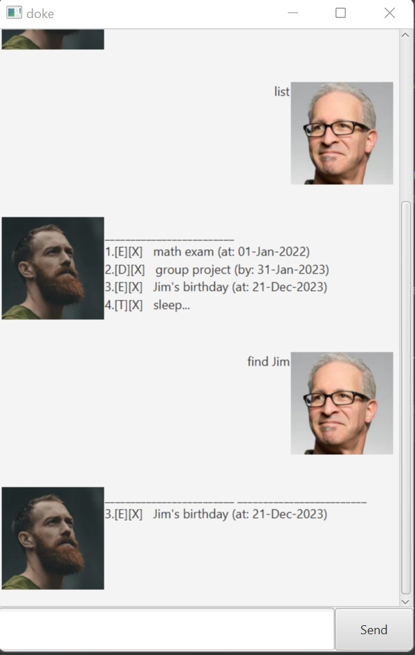

# User Guide

This User guide is made using [AddressBook Level 3 User Guide](https://se-education.org/addressbook-level3/UserGuide.html) and [Yem chatbot](https://sugiyem.github.io/ip/) as a reference.

Doke is an desktop app which helps manage your tasks. It can be used via both Command Line Interface (CLI) and Graphical User Interface (GUI), however, it is more optimized for CLI use.

* Quick Start
* Features
  * Add a Task:
    * Add a Todo: `todo`
    * Add a Dealine: `deadline`
    * Add an Event: `event`
  * List out the tasks: `list`
  * Delete a task: `delete`
  * Update task:
    * Mark done: `mark`
    * Mark not done: `unmark`
  * Sort task: `sort`
  * Find a certain string: `find`
  * Stop program: `bye`

##Quick Start 

Pre-requisite: Have Java version 11 or later installed on your device.

1. Download the latest doke.jar from [here](https://github.com/gerardstevan/ip/releases/tag/A-Release).

2. Move the file to the folder you want to use as the home folder for your Doke app.

3. Double left-click the file to start the app. A window similar to the one shown below should appear after a moment. 


4. Refer to the Features section below for details of the commands.


## Features 
####Note
Anything inside the `[]` are the input to be supplied by the user. Anything not in the `[]` need to be written as is. Everything component of the command is mandatory.

###Add a to-do task: `todo`
Add a todo task to the taskList.

Format: `todo [task]`

Example:
* `todo eat`
* `todo Do your CS2103T IP increment`
* `todo get enough sleep`

###Add a deadline task: `deadline`
Add a deadline task to the taskList. There need to be the deadline date for the task.

Format: `deadline [task] /by [time]`

Example:
* `deadline grade missions /by 2022-09-09`
* `deadline CS2103T quiz /by 2022-10-20`
* `deadline finish cca task /by 2025-12-12`

### <a name="event"></a> Add an event task: `event`
Add a event task to the taskList. There need to be event date for the task.

Format: `deadline [task] /at [time]`

Example:
* `event eat with roomate /at 2022-10-10`
* `event play basketball /at 2022-09-18`
* `event go back home /at 2022-12-01`

###list out the tasks: `list`
List out all the tasks in the tasklist.

Format: `list`

sample output:
```
The following is your stored task:

_________________________ 
1.[E][ ]   math exam (at: 01-Jan-2022)
2.[T][X]   sleep
3.[D][X]   group project (by: 31-Jan-2023)
4.[E][X]   Jim's birthday (at: 21-Dec-2023)
5.[T][ ]   do homework
6.[T][ ]   cook
_________________________ 
```

###Delete a task: `delete`
Delete the specified task by number which is its position in the taskList from the taskList.

Format: `delete [taskPosition]`

Example:
* `delete 2`

###Mark a task as done: `mark`
Mark the specified task by number which is its position in the taskList as done.


Format: `mark [taskPosition]`

Example:
* `mark 1`

###Mark a task as not done: `unmark`
Mark the specified task by number which is its position in the taskList as not done.


Format: `unmark [taskPosition]`

Example:
* `unmark 1`

###Sort the tasks: `sort`
Sort the tasks based on the timing of each. Todo events will be at the end.

Format: `sort`

sample output:
```
Here's the sorted task
_________________________ 
1.[E][ ]   math exam (at: 01-Jan-2022)
2.[D][X]   group project (by: 31-Jan-2023)
3.[E][X]   Jim's birthday (at: 21-Dec-2023)
4.[T][X]   sleep
5.[T][ ]   do homework
6.[T][ ]   cook
_________________________
```

###Find tasks with certain Strings: `find`
Find the tasks which contains the input String in its description.

Format: `find [string]`

Example:
* `find Jim`

sample output:
```
_________________________ 
Here's what we found:
3.[E][X]   Jim's birthday (at: 21-Dec-2023)
_________________________ 
```

###Terminate/stop the program: `bye`
Terminate/stop the program. 

Format: `bye`


##Command Summary

| Action                 | Format, example                                                  |
|------------------------|------------------------------------------------------------------|
| Add Todo               | `todo [task]`, e.g., `todo eat`                                  |
| Add Event              | `event [task] /at [time]`, e.g., `event party /at 2022-10-10`    |
| Add Deadline           | `deadline [task] /by [time]`, e.g., `deadline hw /by 2023-01-01` |
| List out tasks         | `list`                                                           |
| Delete a task          | `delete [taskNum]`, e.g., `delete 1`                             |
| Mark task done         | `mark [taskNum]`, e.g., `mark 1`                                 |
| Mark task not done     | `unmark [taskNum]`, e.g., `unmark 1`                             |
| Sort task              | `sort`                                                           |
| Find a certain string  | `find [string]`, e.g., `find eat`                                |
| Terminate/stop program | `bye                                                             |


